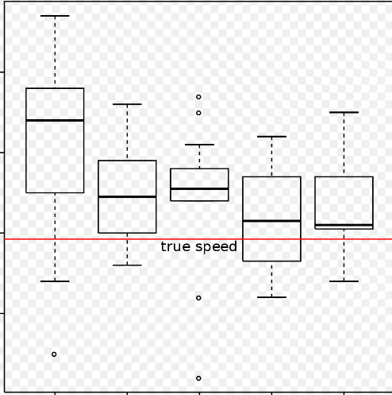
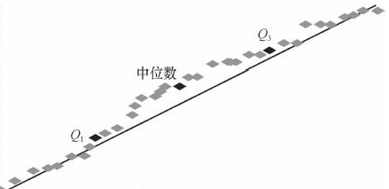
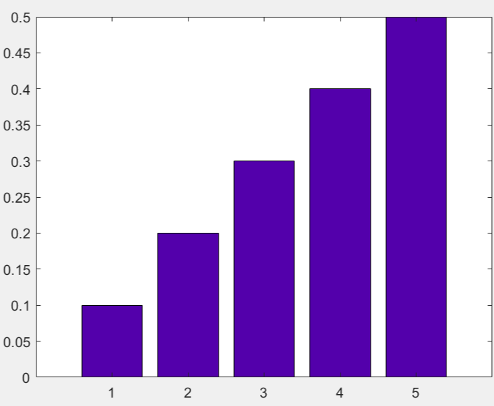
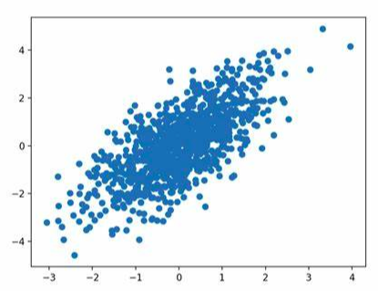
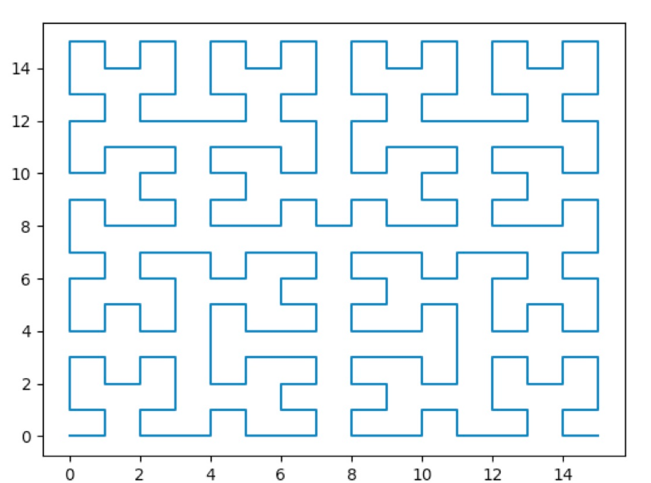
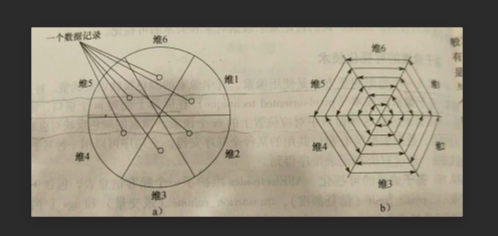

## 数据对象与属性类型
属性是一个数据字段，在文献中，属性、维、特征和变量可以互换使用。
用来描述一个给定对象的一组属性称作属性向量（或特征向量）。
涉及一个属性的数据分布称为单变量的，双变量分布涉及两个属性，以此类推。

属性类型：
+ 标称属性：一些符号或事物的名称，可被看作分类的（枚举类型）。
+ 二元属性：特殊标称属性，取值只有0和1（布尔类型）。一个二元属性是对称的，如果两种状态有同等价值且携带相同权重（0和1可以互换）。
+ 序数属性：可能值之间具有具体意义的序，但相继之间的差是未知的。
+ 数值属性：整数和实数表示，区间标度属性用相等的单位尺度度量（摄氏度），比率标度属性有固定零点（开氏温标）

离散属性（可数）与连续属性（不可数）。

## 数据的基本统计描述
中心趋势度量：均值、中位数和众数。

截尾均值：丢弃高低极端值后的均值。

具有一个、两个、三个众数的集合分别称为单峰的、双峰的和三峰的。具有两个或多个众数的集合是多峰的。

度量数据的散布：极差、四分位数、方差、标准差和四分位数极差(IQR)。

分位数是取自数据分布的每隔一定间隔上的点，把数据划分成基本上大小相等的连贯集合。二分位数对应中位数。

对于描述倾斜分布，单个散布数值度量不是很有用。

识别可疑离群点的通常规则：挑选落在第三个四分位数之上或第一个四分位数之下至少1.5倍IQR处的值。

分布的五数概括：最大最小值和中位数，第一四分位数和第三四分位数。

盒图：五数概括。
+ 盒的端点在两个四分位数上
+ 盒的长度是四分位极差
+ 中位数在盒内用线标记
+ 盒外两条线（胡须）延伸到最大最小值。

分位数图/分位数-分位数图（单变量）：

直方图：

散点图（数据相关）：

## 数据可视化
+ 基于像素的技术：对于m维数据集，在屏幕上创建m个窗口，将每一维的值映射到对应位置，颜色反映对应的值
+ 空间填充曲线（圆弓分割技术）

+ 散点图/散点图矩阵
+ 切尔诺夫脸

+ 人物线条画
+ n-vision
+ 树图
+ 词云

## 相似性和相异性
+ 数据矩阵（对象-属性结构）：`m[i][j] = xij`，存放n个对象m个属性
+ 相异性矩阵（对象-对象结构）：`m[i][j] = d(xi, xj)`，存放相异性

数据矩阵被称为二模矩阵；相异性矩阵为单模矩阵。

计算标称属性所刻画的对象之间的相异性：根据两个对象之间的不匹配率来计算。

对称的二元相异性：`d(i, j) = (i取0j取1的个数 + i取1j取0的个数)/总数`。

非对称的二元相异性：`d(i, j) = (i取0j取1的个数 + i取1j取0的个数)/i和j至少一个为1的个数`。

非对称的二元相似性（Jaccard系数）：`sim(i, j) = 1 - d(i, j)`。

数值距离度量：
+ 欧几里德距离：`d(i, j) = sqrt((xi1 - xj1)^2 + (xi2 - xj2)^2 + ...)`
+ 曼哈顿距离：`d(i, j) = |xi1 - xj1| + |xi2 - xj2| + ...`
+ 闵可夫斯基距离：`d(i, j) = ((xi1 - xj1)^h + (xi2 - xj2)^h + ...)^(1 / h)`
+ 上确界距离（切比雪夫距离）：`d(i, j) = max|xik - xjk|`

度量性质：
+ 非负性：度量非负
+ 同一性：到自身距离为0
+ 对称性：对称函数
+ 三角不等式

序数度量：映射到`[0, 1]`上。

混合度量：缺失不计算，其余每项计算后映射到`[0, 1]`上。

余弦相似性：`sim(x, y) = (xy) / (||x|| ||y||)`