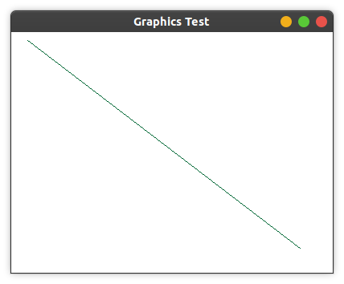
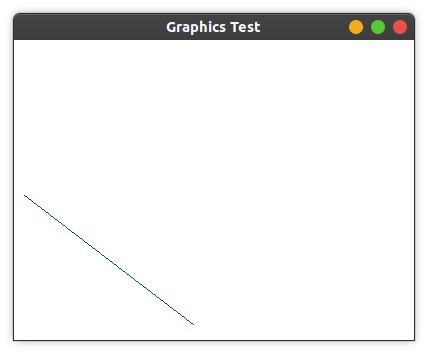
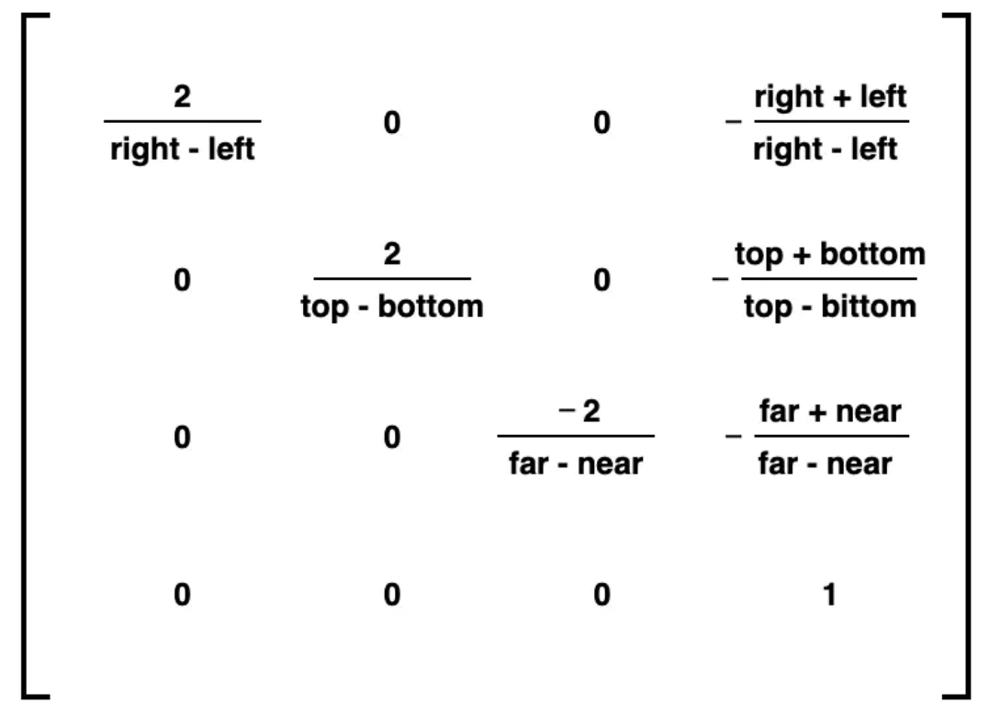

# 坐标系统
利用`gluOrtho2D`设定一个二维笛卡尔坐标系，函数变量制定了显示图形的坐标范围。该函数指定正交投影，在调用前需要通过`glMatrixMode`设置当前的矩阵模式为投影模式。操作前建议调用`glLoadIdentity`，将投影矩阵设置为一个单位矩阵，保证坐标值不会受到以前设置的矩阵的影响。

## 示例
```c++
#include <GL/gl.h>
#include <GL/glut.h>

void init() {
    glClearColor(1, 1, 1, 0);
    glMatrixMode(GL_PROJECTION);
    glLoadIdentity();
    gluOrtho2D(0.0, 200.0, 0.0, 150.0);
}

void draw() {
    glClear(GL_COLOR_BUFFER_BIT);

    glColor3f(0.0, 0.4, 0.2);
    glBegin(GL_LINES);
        glVertex2i(180, 15);
        glVertex2i(10, 145);
    glEnd();

    glFlush();
}

int main(int argc, char** argv) {
    glutInit(&argc, argv);
    glutInitDisplayMode(GLUT_SINGLE | GLUT_RGB);
    glutInitWindowPosition(100, 100);
    glutInitWindowSize(400, 300);

    glutCreateWindow("Graphics Test");

    init();
    glutDisplayFunc(draw);

    glutMainLoop();
    return 0;
}
```

效果：



如果将`gluOrtho2D(0.0, 200.0, 0.0, 150.0);`改为`gluOrtho2D(0.0, 400.0, 0.0, 300.0);`，即将投影区域改为和显示区域相同大小：



## 正交投影
正交投影将三维空间的事物投影到二维平面中，无论物体远近，大小均不变。

三维空间的正交投影矩阵：



对于二维空间的正交投影矩阵（上面的代码中使用`gluOrtho2D`设置），正好是`M33`（去掉`far-near`的余子式）。

该矩阵可以将一个原画布上的点映射到标准化设备坐标中（NDC）。以`x`为例：
投影后的位置`x' = (2x - right - left) / (right - left)`。
分子可以写为`x - left - (right - x)`，即当前坐标到左侧距离与到右侧距离之间的差（当`x`在最左时这个式子等于`-(right - letf)`，最右时这个式子等于`(right - left)`，超过这个范围的点不会被渲染），这样就可以把值映射到`[-1, 1]`之间。

# 画*
## 画点
```c++
glBegin(GL_POINTS);
    glVertex2i(100, 100);
    glVertex2i(101, 100);
    glVertex2i(102, 100);
glEnd();
```


## 画线段
```c++
glBegin(GL_LINES);
    glVertex2i(180, 15);
    glVertex2i(10, 145);
    glVertex2i(20, 30);
    glVertex2i(40, 30);
glEnd();
```

如果点的个数为奇数，最后的点会被忽略。

## 画折线
```c++
glBegin(GL_LINE_STRIP);
    glVertex2i(180, 15);
    glVertex2i(10, 145);
    glVertex2i(20, 30);
    glVertex2i(40, 30);
glEnd();
```

折线不要求点成对出现。

## 画封闭折线
```c++
glBegin(GL_LINE_LOOP);
    glVertex2i(180, 15);
    glVertex2i(10, 145);
    glVertex2i(20, 30);
    glVertex2i(40, 30);
glEnd();
```

## 画封闭曲线
使用折线来近似显示简单曲线。

# 填充区图元&多边形填充区
利用多边形片面对一曲面进行的逼近称为表面细分，或者可以使用多边形网格来拟合曲面。

使用一组多边形片面描述的对象称为标准图形对象或图形对象。

在处理前需要将凹多边形划分为凸多边形以提高效率。

## 识别凹多边形
利用叉积识别多边形：一部分邻边叉积为正，另一部分为负。
```c++
using vertex = std::pair<int, int>;
constexpr size_t VSIZE = 6;

std::array<vertex, VSIZE> poly = {
        std::make_pair(100, 100),
        {200, 100},
        {300, 200},
        {150, 250},
        {150, 275},
        {100, 275}
};

bool check() {
    bool pos_flag = false, neg_flag = false;
    for (int i = 0; i < VSIZE; i++) {
        int j = (i + 1) % VSIZE;
        int k = (i + 2) % VSIZE;

        vertex e1 = std::make_pair(poly[j].first - poly[i].first, poly[j].second - poly[i].second),
                e2 = std::make_pair(poly[k].first - poly[j].first, poly[k].second - poly[j].second);

        int temp = e1.first * e2.second - e1.second * e2.first;
        if (temp > 0) {
            pos_flag = true;
        }
        else if (temp < 0) {
            neg_flag = true;
        }
    }

    return pos_flag && neg_flag;
}
```

## 多边形分割
+ 叉积为负说明需要进行分割。延长第一条边，直到与多边形相交。延长线即为分割边
+ 沿多边形的边逆时针旋转，落在x轴下方的部分需要进行分割