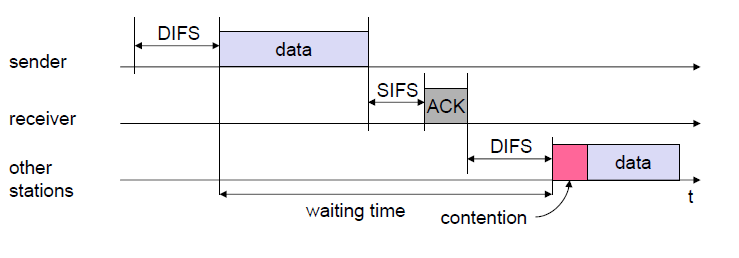
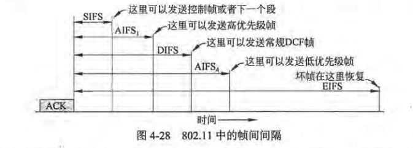
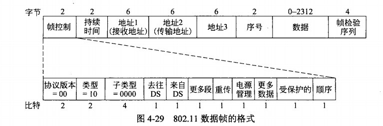

# 无线网络和移动网络
移动通信和无线通信的区别：无线网络强调“无线”，即通信双方间没有实体线路连接，如家用WIFI；而移动通信强调“移动”，即通信双方至少有一方处于移动的状态，且移动的过程中通信不中断。

## CDMA
将需要发送的0值编码为-1。每个发送方都具有一个CDMA编码，所有的编码之间均正交。发送时将自己的CDMA编码与发送信息相乘，然后进行发送。同一时间（同一个码片）内发送的信息是所有发送方信息的和。

解码时，将对应的CDMA编码与接收到的信息求内积，并除以码片数量，得到的就是发送的信息。

例子：
```
对于设备A(-1, -1, -1, 1, 1, -1, 1, 1)和设备B(-1, -1, 1, -1, 1, 1, 1, -1)，两个设备的CDMA编码是正交的（1 + 1 - 1 - 1 + 1 - 1 + 1 - 1 = 0）。
如果两个设备在同一码片内发送信息时（假定A发送1,B发送0），则最终的消息是：(-1 + 1, -1 + 1, -1 - 1, 1 + 1, 1 - 1, -1 - 1, 1 - 1, 1 + 1) = (0, 0, -2, 2, 0, -2, 0, 2)。
如果要对设备A的消息进行解码，则求内积0 + 0 + 2 + 2 + 0 + 2 + 0 + 2 = 8，除以8后得到1,即A在该码片中发送的消息为1。
```

## MACA（冲突避免多路访问）
IEEE802.11为无线LAN设计的随机访问协议。

流程：
+ A首先给B发送一个RTS（Request To Send）帧
+ B使用CTS（Clear To Send）帧作为应答
+ 如果其他站侦听到了这些帧，则必须保持沉默，检查CTS帧即可知道需要保持沉默的时间

隐藏终端问题：A向B传输数据，C向B传输数据，由于无线电范围太小导致的A和C之间无法侦听，互相隐藏。

暴露终端问题：A向B传输数据，D向C传输数据，由于无线电范围太大，A和D同时侦听到了对方，即使信道间互不干扰，此时信道上至多只有一个站可以发送消息。

## CSMA/CA（带有冲突避免的CSMA）
+ 侦听一个很短的时间（DIFS），没有信号
+ 倒计时空闲的槽，当有帧在发送则暂停计数器
+ 计数器为0,发送帧
+ 如果发送成功，则接收方回传短确认
+ 如果没收到短确认，则将时间槽加倍



## NAV（网络分配向量）
为了减少究竟哪个站在进行发送的模糊不清，802.11的信道侦听包含物理侦听和虚拟侦听。

虚拟侦听允许每个站保留一个信道何时要用的逻辑记录。每个帧携带一个NAV字段，说明这个帧需要传输的时间。所有侦听到这个帧的站都将延后他们的传输。

## 机制需求
+ 可靠性：无线环境嘈杂，更加不可靠。增加传输成功概率的方法是降低传输速率，另一种策略是发送短帧，802.11允许把帧拆解为更小的段，每个段都有自己的校验和
+ 节能：客户端可以在发送到AP的帧中设置一个电源管理位，告诉AP进入省电模式
+ 服务质量：常规的数据帧之间的间隔称为DCF帧间隔（DIFS），任何站都可以在介质空闲DIFS后尝试抓取信道发送一个新帧；最短的间隔是短帧间间隔（SIFS），允许发送控制帧或下一个段；仲裁帧间空间（AIFS）可以用来发送不同优先级的帧；扩展帧间间隔（EIFS）用于收到坏帧并报告问题



802.11帧结构：


有效载荷前的格式即为逻辑链路控制。