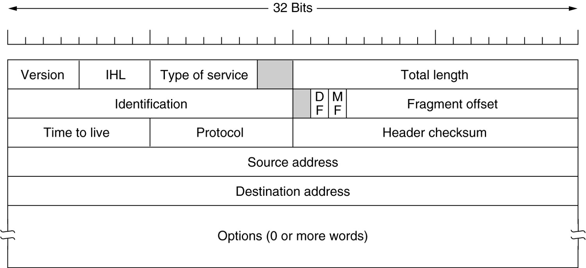
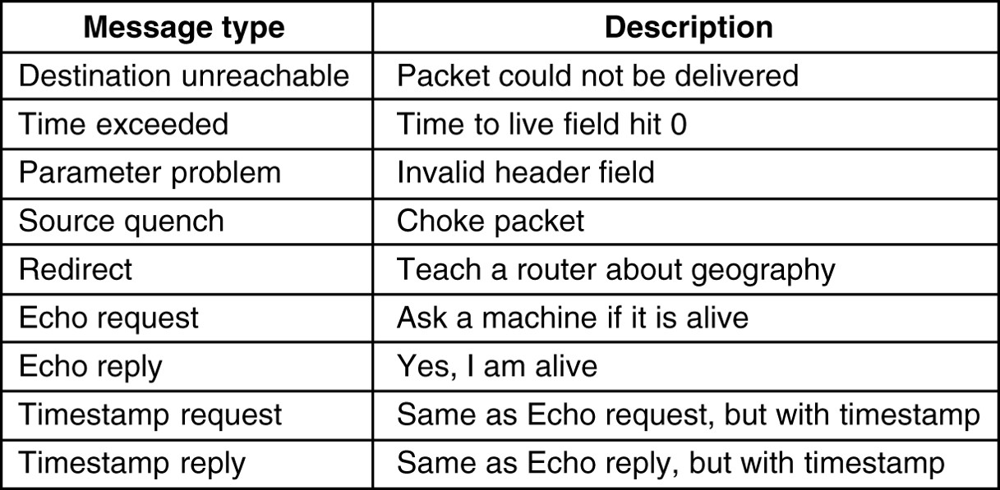
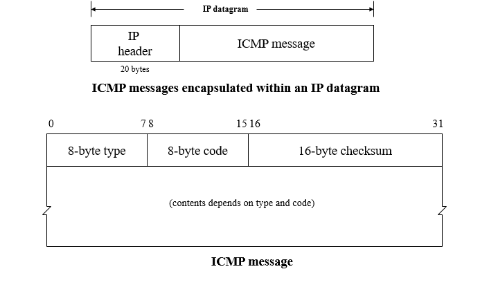

# 网络层
目标：
+ 向上提供的服务应该独立于路由器技术
+ 向传输层屏蔽路由器的数量，类型，拓扑关系等
+ 传输层可用的网络地址应该有一个统一的编码方案

## 虚电路与数据报网络

虚电路网络的路由表需要包含`in`和`out`两列。

## IPv4
### IP报文格式

+ 版本号：IP协议版本
+ 首部长度：IPv4数据报可以包含可变数量的选项，所以需要这4个比特来确定报头长度
+ 服务类型：表示不同类型（如低延时、高吞吐）或不同等级的服务
+ 数据报长度：数据报总长度
+ 标识：IP分段的唯一标识
+ DF：是否禁用分段
+ MF：0表示这是最后一个分片
+ 片偏移：该片的数据开始位置
+ TTL：保证数据报不会在网络中循环，每当数据报交由一台路由器处理时，该字段减一，若TTL为0，数据报会被丢弃
+ 协议：传输层协议，6代表TCP，17代表UDP
+ 首部校验和：检测报文首部是否有错
+ 源目的地址
+ 目标地址
+ 扩展IP首部
+ 数据

### IPv4编址
地址长度32字节，按照点分十进制法书写。

某些主机接口于一个路由器接口的网络形成一个子网，写作`a.b.c.d/x`，其中`x`表示子网掩码，为所有主机IP地址最长公共前缀的长度，经常被称为该地址的前缀。

使用单个网络前缀通告多个网络的能力通常称为地址聚合/路由聚合/路由摘要。如果在转发过程中发生冲突，选择具有最长匹配前缀的地址（The Longest Matching Prefix）。

### 网络地址转换（NAT）
NAT路由器对外界隐藏了内部网络的细节，该路由器有一张NAT转换表，在表项中包含了端口号及其IP地址。

NAT转换表：

| WAN端 | LAN端 |
| --- | --- |
| 138.76.29.7 5001 | 10.0.0.1 3345 |
| ... | ... |

表示内网`10.0.0.1`与互联网中`138.76.29.7:5001`进行通信，而`138.76.29.7:5001`回传消息时会发送到NAT路由器的`3345`端口。

问题：
+ 端口号本应用于进程编址，但事实上被用于主机编址
+ 路由器仅应当处理至多第三层的分组
+ NAT违反了端到端原则（妨碍P2P应用）
+ 应该使用IPv6解决地址短缺问题

对于P2P应用，对等方B在NAT后，则不能接收连接。如果对等方A不在NAT后，A需要通过中间对等方C（不位于NAT后，且已经与B建立联系）与B联系。这种方法被称为连接反转并用于NAT穿越。如果A和B都在NAT后，需要通过应用程序进行中继处理。

## IPv6
## ICMP
### 消息类型

### 消息格式

## DHCP