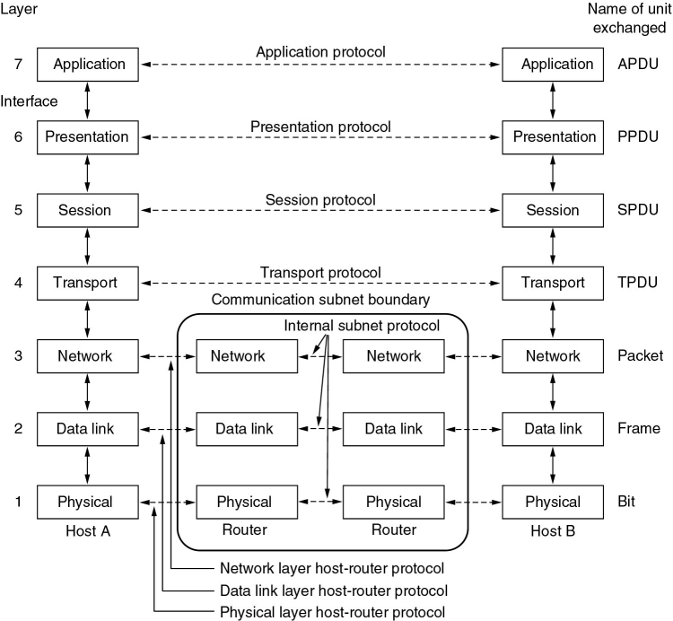
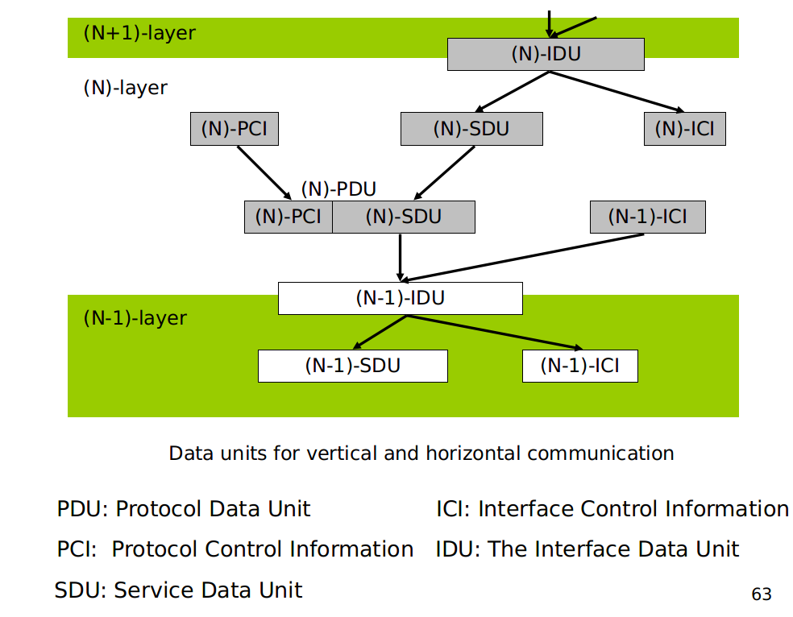

# 计算机网络和因特网
+ 主机/端系统：运行应用程序，处于网络边缘的系统
+ 通信链路和分组交换机：将端系统连接在一起，最主要的分组交换机是路由器和链路层交换机
+ 一个分组所经历的一系列通信链路和分组交换机称为通过该网络的路径
+ 端系统需要通过因特网服务提供商(ISP)接入因特网

## 计算机网络分类
+ 个域网
+ 局域网
+ 城域网
+ 广域网
+ 互联网

## 协议层次及其服务模型
五层因特网协议栈：
+ 应用层
+ 运输层
+ 网络层
+ 链路层
+ 物理层

七层ISO OSI参考模型：
+ 应用层
+ 表示层
+ 会话层
+ 运输层
+ 网络层
+ 链路层
+ 物理层

层和协议的集合称为网络体系结构。

某层向它的上一层提供的功能为服务，一个服务由一组服务原语进行说明。

计算机网络设计过程中需要考虑的问题：
+ 命名和寻址
+ 差错控制
+ 流量控制
+ 路由
+ 可伸缩性
+ 服务质量
+ 安全
+ ...

