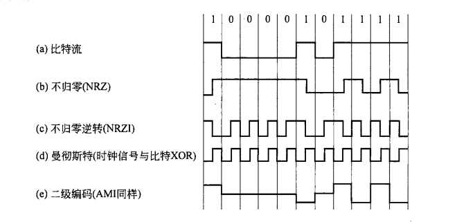

# 计算机网络和因特网
+ 主机/端系统：运行应用程序，处于网络边缘的系统
+ 通信链路和分组交换机：将端系统连接在一起，最主要的分组交换机是路由器和链路层交换机
+ 一个分组所经历的一系列通信链路和分组交换机称为通过该网络的路径
+ 端系统需要通过因特网服务提供商(ISP)接入因特网

## 计算机网络分类
+ 个域网
+ 局域网
+ 城域网
+ 广域网
+ 互联网

## 协议层次及其服务模型
五层因特网协议栈：
+ 应用层
+ 运输层
+ 网络层
+ 链路层
+ 物理层

七层ISO OSI参考模型：
+ 应用层
+ 表示层
+ 会话层
+ 运输层
+ 网络层
+ 链路层
+ 物理层

层和协议的集合称为网络体系结构。

某层向它的上一层提供的功能为服务，一个服务由一组服务原语进行说明。

计算机网络设计过程中需要考虑的问题：
+ 命名和寻址
+ 差错控制
+ 流量控制
+ 路由
+ 可伸缩性
+ 服务质量
+ 安全
+ ...


# 物理层
## 傅利叶分析
快速傅利叶变换：略。

传输设施对于傅利叶分量的衰减不同，造成接收到的信号发生变形。该过程中不会明显减弱的频率的宽度即为带宽。

从0到某个最大频率的信号为基带信号，将被搬移并占用更宽宽度的信号为通带信号。

对于比特率为`b bps`的信道，发送一个字节所需要的时间为`8/b sec`，即对应的谐波的频率为`b/8 Hz`，假定最大截止频率为`3000Hz`，则可发送的谐波数为`24000/b`个。

如果任意一个信号通过了一个带宽为`B`的低通滤波器，那么只需要进行每秒`2B`次采样就可以重构出信号。如果信号包含了`V`个离散等级（对于二进制信号，`V=2`），则有尼奎斯特定理（无噪声）：
```
最大数据速率=2B logV bits/sec
```

信号功率与噪声功率的比值被称为信噪比，通常情况下使用公式`10 log10(S/N)`，单位为分贝。

香农的结论：对于一条带宽为`B`的信道，信噪比为`S/N`，其最大比特率为：`B log(1 + S/N)`。

## 传输介质
有时候最有效率的传输方式可能是使用磁介质（如DVD）保存后物理传输（笑）。
### 双绞铜线
最为便宜且普遍的引导型传输媒体，高速LAN联网的主要方式。

传输术语补充：
+ 全双工：可以同时向两个方向发送信息
+ 半双工：可以向两个方向发送信息，但同一时刻只有一个方向可以发送
+ 单工：只有一个方向可以发送

### 同轴电缆
由两个铜导体组成，但两个导体是同心的而不是并行的。

同轴电缆在电缆电视系统中相当普遍。

### 光纤
引导光脉冲的媒体，每个脉冲表示一个比特，且不受电磁干扰，信号衰减低，难以窃听。

### 陆地无线电信道
无线电信道不需要物理线路，通道特性极大地依赖于传播环境和传输距离。

### 卫星无线电信道
一颗通信卫星连接两个或多个位于地球上的微波发射方/接受方（地面站）。常用的通信卫星：同步卫星和近地卫星。


## 基带传输
使用正电压表示1,使用负电压表示0。对光纤而言，光存在表示1,不存在表示0。

几种实现方式：


NRZ方案遇到1时将信号进行反转。

接受方需要知道时间才能恢复数据。给接收方单独发送时钟数据，时钟信号与电信号异或得到结果，被称为曼彻斯特编码。

平衡信号，使用+1V和-1V表示信号1,0表示信号0，这种方案被称为双极编码。

4B/5B编码：每4个比特被映射为5个比特。

## 通带传输
发送低频信号需要相当大的天线，故采用通带传输。

将占用`0~B Hz`的基带信号搬移到频谱位置`S~S+B Hz`上，且不改变信号携带的信息。需要进行调制/解调。


+ 幅移键控：通过不同的振幅表示0和1
+ 相移键控：通过波形偏移表示不同信号。二进制相移键控只有0度和180度，如果同时表达两个位，可以使用正交相移键控，即45度，135度，225度，和315度四种偏移。映射方式可以采取格雷码，在星座图上找到距离最近的点，进行错误恢复。

## 复用
+ 频分复用：多个用户共享一个信道，将频谱分为几个频段，每个用户使用一个频段来发送信号。多分配频率作为保护带；正交频分复用不需要保护带
+ 时分复用：每个用户周期性地获得一个时间槽，需要增加保护时间
+ 码分复用：见无线网络和移动网络CDMA