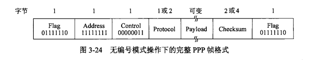
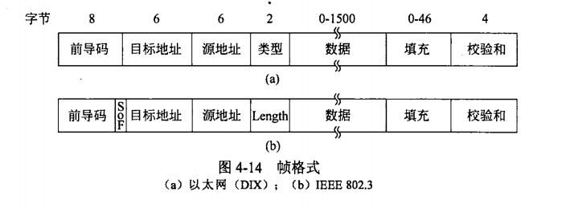
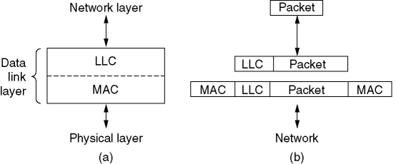
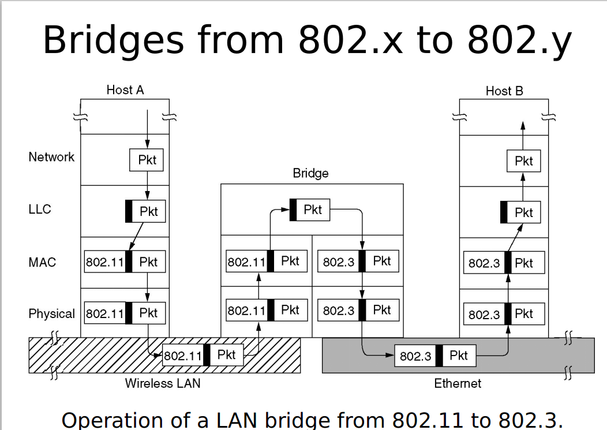
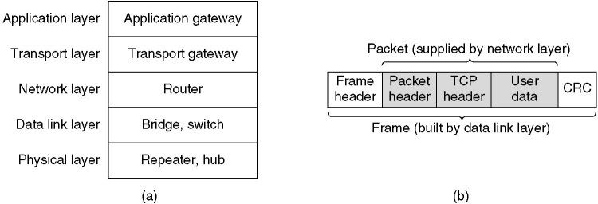
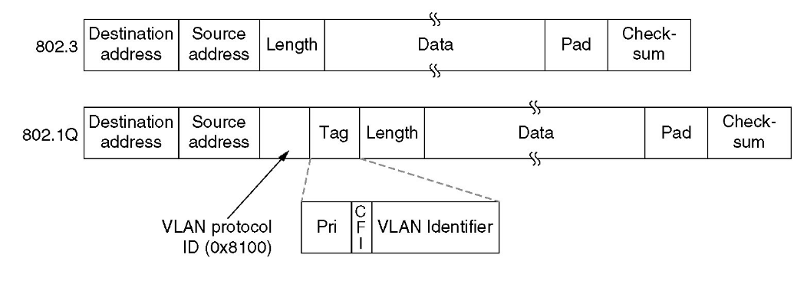

# 数据链路层
+ 结点：运行链路层协议的任何设备
+ 链路：沿着通信路径连接相邻结点的通信信道

在通过特定的链路时，传输结点将数据报封装在链路层帧中，并将该帧传送到链路中。

完成的功能：
+ 向网络层提供一个定义良好的接口
+ 处理传输错误
+ 调节数据流，确保接收方不会被淹没

拆分比特流的方法：
+ 字节计数法：使用帧头部的一个字段来标识该帧中的字符数
+ 字节填充的标志比特法：使用特定的字节来标识帧的开始和结束，当标识和帧中内容相同时，需要使用转义字符进行转义
+ 比特填充的标志比特法：以HDLC（高级数据链路控制协议）为例，0b01111110被用作标志字节，在中间的数据中，每当遇到连续的5个1,则自动在后面追加一个0
+ 物理层编码违禁法：对于4B5B线性编码，使用空闲的编码控制帧的开始和结束。

链路层主体在网络适配器中实现。

## 差错检测和纠正技术
奇偶校验：为数据添加一个比特。偶校验中需要保证所有数据的异或结果为0，奇校验相反。

二位奇偶校验包括行校验和列校验，并且可以找到出错位置。

接收方检测和纠正差错的能力被称为前向纠错（Forward Error Correction，FEC）。

## 海明码
数据块总长为n，其中包含m位数据和r位校验位（即`n = m + r`），记为(n, m)码。

两个码字中不同位的个数称为海明距离。如果两个码字的海明距离为d，则需要d个错误才能将一个码字转变为另一个码字。如果需要检测d个错误，那么码字最后海明距离至少为d+1（即保证其不会变为另一个码字）；如果需要纠正d个错误，那么码字至少需要2d+1的海明距离（即d个错误发生时可以找到离它最近的合法码字）。

在只考虑一个位置出错的情况下，对于`2^m`个合法消息，任何一个消息都会有n个非法码字，使得这个非法码字和合法码字间的海明距离为1。因此每个合法消息需要使用`n+1`个位模式来识别（包括不出错的情况）。由于总共只有`2^n`个位模式，所以我们要求`(n + 1)2^m <= 2^n`，即`(m + r + 1) <= 2^r`。

海明码校验步骤：
+ 选取第1,2,4,8,...,2^k为校验位，其余位置为数据位
+ 对于第1位，其需要校验所有剩下的奇数位置上的值，或者说，二进制第0位为1位置上的值；其余校验位类推
+ 满足奇偶校验中的一种，补充校验位。

## 里德所罗门码
用于二维码纠错。TODO。

## CRC循环校验
CRC编码也被称为多项式编码。所有的CRC计算采取模2运算（异或）。

对于一个给定的数据段D，发送方需要选择r个附加比特，使得用模2算术运算时这d+r个比特刚好可以被G除尽。

因为`D*2^r XOR R = nG`，所以`D*2^r = nG XOR R`，即`R = D*2^r % G`。每个CRC标准都可以检测小于r+1比特的差错。

对于比特串G，也可以写作多项式的形式，如0x10011等价于`x^4 + x + 1`。对于一个r阶的多项式，我们也选择r位的纠错码。

## 链路层协议
### PPP（点到点协议）
串行线路Internet协议（SLIP）的改进。

主要特性：
+ 一种成帧方法：毫无歧义地区分出一帧的结束和下一帧的开始
+ 一个链路控制协议：启动线路，测试线路，协商参数，关闭线路，该协议被称为链路控制协议（LCP）
+ 一种协商网络层的办法：对于每一种不同的网络层，都有一个不同的网络控制协议(NCP)

+ 地址字段始终是上值，表示所有站点都接受该帧
+ Control字段默认值00000011，表示无编号帧
+ 协议字段中以0开始的编码定义为IPv4等网络层协议，以1开始的编码定义PPP自身的配置协议

### HDLC（高级数据链路控制）
早期被广泛使用的家庭协议实例。

与PPP的区别：
+ PPP是面向字节的，HDLC是面向比特的，且允许帧的长度不是字节的倍数
+ HDLC是可靠传输，提供了滑动窗口，确认和超时机制

# 介质控制访问子层
## 信道划分协议
静态信道划分技术：时分多路复用(TDM)，频分多路复用(FDM)。划分后所用时间是划分前的N倍，效率极低。

动态划分的假设：
+ 流量独立
+ 单信道
+ 冲突可观察
+ 时间连续或分槽
+ 载波侦听或不侦听

### ALOHA
非时隙的协议。当一个帧首次到达时，结点立即将该帧完整地传输进广播信道。如果一个传输的帧与一个或多个传输经历了碰撞，这个结点在完全传输完碰撞帧后以概率p进行重传，或以概率1-p进行等待。

最大的信道利用率大约是18%。

### 时隙ALOHA（分槽ALOHA）
补充假设：
+ 所有帧均由L比特组成
+ 时间被划分为L/R秒的时隙，即一个时隙等于传输一帧的时间
+ 结点只在时隙开始时进行传输
+ 结点是同步的，每个结点都知道时隙何时开始

最大效率大约是普通ALOHA的两倍。

### 载波侦听多路访问(CSMA)
坚持CSMA：
+ 首先对信道进行侦听
+ 如果信道空闲，则发送数据
+ 如果信道忙，等待信道变为空闲
+ 如果发生冲突，等待一段随机时间，重复上述步骤

非坚持CSMA：
+ 如果信道在使用中，等待一段随机时间后再进行侦听

p坚持CSMA：
+ 适用于分槽信道
+ 如果信道空闲，则以p的概率发送数据，以1-p的概率推迟发送

### 具有碰撞检测的载波侦听多路访问(CSMA/CD)
如果其读回来的信号不同于它放在信道上的信号，则碰撞发生。

如果检测到碰撞，其立即终止传送，等待一段随机时间，然后再重新尝试传送。

检测冲突的最小时间恰好是将信号从一个站传输到另一个站的时间。

# 以太网
## 经典以太网

前导码10101010，SoF（Start of Frame）为10101011，前导码是10MHz曼彻斯特方波。

目标地址第一位是0,表示这是一个普通地址；目标地址第一位是1,表示这是一个广播地址。

限制最小帧长度，避免冲突发生时，突发噪声在回到发送方前，传送已经结束。

二进制指数后退：在经历了n次碰撞后，结点随机地从`0, 1, 2, ..., 2^n - 1`中选定一个K值进行等待。

IEEE802.2：

LLC（逻辑链路控制协议）可以提供：
+ 不可靠的数据报文服务
+ 带确认的数据报文服务
+ 面向连接的可靠传输服务

LLC用于隐藏802系列协议之间的差异。

# 数据链路交换
`交换机==现代网桥`。

泛洪算法：为网桥准备一个大的哈希表，当网桥第一次被接入网络的时候，哈希表为空。对于每个方向未知的入境帧，网桥将其广播到所有端口。随着时间推移，网桥会逐渐学习到目标地址在那，也就不需要泛洪处理。

后向学习法：对于每一个发送帧，网桥检查他们的源地址，与到达端口和到达时间一并存入哈希表。网桥中有程序定期扫描哈希表，将一段时间之前的表项扔掉。

网桥只要看到MAC地址即可知道如何转发，所以可能在帧完整到达前转发就已经开始。这种转发方式被称为直通式交换或虫孔路由。

生成树路由：
为了提高可靠性，网桥使用冗余链路。冗余链路会生成环路。为了防止环路的影响，采取生成树的方式。

## 虚拟局域网（VLAN）
VLAN基于VLAN感知交换机。网络管理员需要确定有多少个VLAN，哪个计算机位于哪个VLAN，每个VLAN叫什么名字。

网桥必须建立配置表，指明了哪些端口可以到达哪些VLAN。当一帧到来时，如果该帧来自灰色的VLAN，则必须被转发到所有被标记为Gray的端口。VLAN间的通信需要使用路由器提供中继服务。

VLAN标识符标识帧属于哪种颜色。

## ARP
