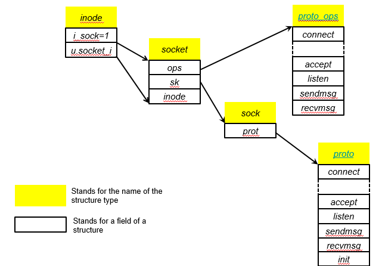

## Socket API及Linux系统调用
```c
#include <sys/socket.h>
/**
 * @param family 协议族：常用INET4（IPv4）和INET6（IPv6）
 * @param type socket类型：STREAM_SOCKET，SOCKET_DGRAM，SOCKET_RAW
 * @param protocol 协议：IPPROTO_TCP，IPPROTO_UDP
 */
int socket (int family, int type, int protocol);
```

Socket结构：



`struct socket`:
```c
/**
 *  struct socket - general BSD socket
 *  @state: socket state (%SS_CONNECTED, etc)
 *  @type: socket type (%SOCK_STREAM, etc)
 *  @flags: socket flags (%SOCK_NOSPACE, etc)
 *  @ops: 保存特定协议的操作
 *  @file: File back pointer for gc
 *  @sk: 网络层表示
 *  @wq: wait queue for several uses
 */
struct socket {
	socket_state		state;

	short			type;

	unsigned long		flags;

	struct file		*file;
	struct sock		*sk;
	const struct proto_ops	*ops;

	struct socket_wq	wq;
};
```

Socket状态：
```c
typedef enum {
	SS_FREE = 0,			/* 没有分配		*/
	SS_UNCONNECTED,			/* 没有连接	*/
	SS_CONNECTING,			/* 正在连接	*/
	SS_CONNECTED,			/* 已连接		*/
	SS_DISCONNECTING		/* 正在断开连接	*/
} socket_state;
```

Socket类型：
```c
/**
 * enum sock_type - Socket types
 * @SOCK_STREAM: stream (connection) socket
 * @SOCK_DGRAM: datagram (conn.less) socket
 * @SOCK_RAW: raw socket
 * @SOCK_RDM: reliably-delivered message
 * @SOCK_SEQPACKET: sequential packet socket
 * @SOCK_DCCP: Datagram Congestion Control Protocol socket
 * @SOCK_PACKET: linux specific way of getting packets at the dev level.
 *		  For writing rarp and other similar things on the user level.
 *
 * When adding some new socket type please
 * grep ARCH_HAS_SOCKET_TYPE include/asm-* /socket.h, at least MIPS
 * overrides this enum for binary compat reasons.
 */
enum sock_type {
	SOCK_STREAM	= 1,
	SOCK_DGRAM	= 2,
	SOCK_RAW	= 3,
	SOCK_RDM	= 4,
	SOCK_SEQPACKET	= 5,
	SOCK_DCCP	= 6,
	SOCK_PACKET	= 10,
};
```

`struct sock_common`：最小化的网络层Socket。

## 协议注册
```c
// 每一个地址协议族都实现了以下结构体
struct net_proto_family {
	int		family;
	int		(*create)(struct net *net, struct socket *sock,
				  int protocol, int kern); // 当socket被创建时，create函数被调用
	struct module	*owner;
};
```

例子：
```c
// IPv4
static const struct net_proto_family inet_family_ops = {
	.family = PF_INET,
	.create = inet_create,
	.owner	= THIS_MODULE,
};
```

```c
// inet_init( )函数用于对AF_INET域协议进行初始化
static int __init inet_init(void)
{
	struct inet_protosw *q;
	struct list_head *r;
	int rc;

	sock_skb_cb_check_size(sizeof(struct inet_skb_parm));

    // tcp协议注册
	rc = proto_register(&tcp_prot, 1);
	if (rc)
		goto out;

    // udp协议注册
	rc = proto_register(&udp_prot, 1);
	if (rc)
		goto out_unregister_tcp_proto;

    // 原生socket注册
	rc = proto_register(&raw_prot, 1);
	if (rc)
		goto out_unregister_udp_proto;

    // ping注册
	rc = proto_register(&ping_prot, 1);
	if (rc)
		goto out_unregister_raw_proto;

	/*
	 *	Tell SOCKET that we are alive...
	 */

    // 重要！
	(void)sock_register(&inet_family_ops);

#ifdef CONFIG_SYSCTL
	ip_static_sysctl_init();
#endif
    // bla bla bla ...
}
```

协议的创建函数：
```c
static int inet_create(struct net *net, struct socket *sock, int protocol,
		       int kern)
{
	struct sock *sk;
	struct inet_protosw *answer;
	struct inet_sock *inet;
	struct proto *answer_prot;
	unsigned char answer_flags;
	int try_loading_module = 0;
	int err;

	if (protocol < 0 || protocol >= IPPROTO_MAX)
		return -EINVAL;

	sock->state = SS_UNCONNECTED;

    // bla bla bla...
}
```

协议注册函数：
```c
/**
 *	sock_register - add a socket protocol handler
 *	@ops: description of protocol
 *
 *	This function is called by a protocol handler that wants to
 *	advertise its address family, and have it linked into the
 *	socket interface. The value ops->family corresponds to the
 *	socket system call protocol family.
 */
int sock_register(const struct net_proto_family *ops)
{
	int err;

	if (ops->family >= NPROTO) {
		pr_crit("protocol %d >= NPROTO(%d)\n", ops->family, NPROTO);
		return -ENOBUFS;
	}

	spin_lock(&net_family_lock);
	if (rcu_dereference_protected(net_families[ops->family],
				      lockdep_is_held(&net_family_lock)))
		err = -EEXIST;
	else {
		rcu_assign_pointer(net_families[ops->family], ops); // 就是个指针赋值，不过是原子的。将ops协议注册到net_families中。
        // net_families：协议列表
		err = 0;
	}
	spin_unlock(&net_family_lock);

	pr_info("NET: Registered protocol family %d\n", ops->family);
	return err;
}
```

socket函数流程：
+ 调用`_sys_socket`
+ 使用`sock_create`创建socket对象
+ 再次调用`__sock_create`
+ 从`net_families`中获取协议`ops`
+ 调用对应的`create`函数

接下来的步骤（以`AF_INET`为例）：
+ 枚举每一个协议，找到需要使用的那一个
+ 赋值对应ops
+ 使用`sk_alloc`创建对应的`sock`对象
+ 调用协议提供的初始化函数

```c
/* This is used to register socket interfaces for IP protocols.  */
struct inet_protosw {
	struct list_head list;

        /* These two fields form the lookup key.  */
	unsigned short	 type;	   /* This is the 2nd argument to socket(2). */
	unsigned short	 protocol; /* This is the L4 protocol number.  */

	struct proto	 *prot;
	const struct proto_ops *ops;
  
	unsigned char	 flags;      /* See INET_PROTOSW_* below.  */
};
```

```c
/* The inetsw table contains everything that inet_create needs to
 * build a new socket.
 */
static struct list_head inetsw[SOCK_MAX];
```

```c
/* Upon startup we insert all the elements in inetsw_array[] into
 * the linked list inetsw.
 */
static struct inet_protosw inetsw_array[] =
{
	{
		.type =       SOCK_STREAM,
		.protocol =   IPPROTO_TCP,
		.prot =       &tcp_prot, // 协议软件提供的操作
		.ops =        &inet_stream_ops, // socket layer 提供的操作
		.flags =      INET_PROTOSW_PERMANENT |
			      INET_PROTOSW_ICSK,
	},

	{
		.type =       SOCK_DGRAM,
		.protocol =   IPPROTO_UDP,
		.prot =       &udp_prot,
		.ops =        &inet_dgram_ops,
		.flags =      INET_PROTOSW_PERMANENT,
       },

       {
		.type =       SOCK_DGRAM,
		.protocol =   IPPROTO_ICMP,
		.prot =       &ping_prot,
		.ops =        &inet_sockraw_ops,
		.flags =      INET_PROTOSW_REUSE,
       },

       {
	       .type =       SOCK_RAW,
	       .protocol =   IPPROTO_IP,	/* wild card */
	       .prot =       &raw_prot,
	       .ops =        &inet_sockraw_ops,
	       .flags =      INET_PROTOSW_REUSE,
       }
};
```

```c
static int __init inet_init(void)
{
	// bla bla bla...

	/*
	 *	Add all the base protocols.
	 */

	if (inet_add_protocol(&icmp_protocol, IPPROTO_ICMP) < 0)
		pr_crit("%s: Cannot add ICMP protocol\n", __func__);
	if (inet_add_protocol(&udp_protocol, IPPROTO_UDP) < 0)
		pr_crit("%s: Cannot add UDP protocol\n", __func__);
	if (inet_add_protocol(&tcp_protocol, IPPROTO_TCP) < 0)
		pr_crit("%s: Cannot add TCP protocol\n", __func__);
#ifdef CONFIG_IP_MULTICAST
	if (inet_add_protocol(&igmp_protocol, IPPROTO_IGMP) < 0)
		pr_crit("%s: Cannot add IGMP protocol\n", __func__);
#endif

	/* Register the socket-side information for inet_create. */
	for (r = &inetsw[0]; r < &inetsw[SOCK_MAX]; ++r)
		INIT_LIST_HEAD(r);

	for (q = inetsw_array; q < &inetsw_array[INETSW_ARRAY_LEN]; ++q)
		inet_register_protosw(q);

	// bla bla bla...
}
```

```c
// 向inetsw里面添加元素
void inet_register_protosw(struct inet_protosw *p)
{
	struct list_head *lh;
	struct inet_protosw *answer;
	int protocol = p->protocol;
	struct list_head *last_perm;

	spin_lock_bh(&inetsw_lock);

	if (p->type >= SOCK_MAX)
		goto out_illegal;

	/* If we are trying to override a permanent protocol, bail. */
	last_perm = &inetsw[p->type];
	list_for_each(lh, &inetsw[p->type]) {
		answer = list_entry(lh, struct inet_protosw, list);
		/* Check only the non-wild match. */
		if ((INET_PROTOSW_PERMANENT & answer->flags) == 0)
			break;
		if (protocol == answer->protocol)
			goto out_permanent;
		last_perm = lh;
	}

	/* Add the new entry after the last permanent entry if any, so that
	 * the new entry does not override a permanent entry when matched with
	 * a wild-card protocol. But it is allowed to override any existing
	 * non-permanent entry.  This means that when we remove this entry, the
	 * system automatically returns to the old behavior.
	 */
	list_add_rcu(&p->list, last_perm);
out:
	spin_unlock_bh(&inetsw_lock);

	return;

out_permanent:
	pr_err("Attempt to override permanent protocol %d\n", protocol);
	goto out;

out_illegal:
	pr_err("Ignoring attempt to register invalid socket type %d\n",
	       p->type);
	goto out;
}
```

ops结构体：
```c
struct proto_ops {
	int		family;
	unsigned int	flags;
	struct module	*owner;
	int		(*release)   (struct socket *sock);
	int		(*bind)	     (struct socket *sock,
				      struct sockaddr *myaddr,
				      int sockaddr_len);
	int		(*connect)   (struct socket *sock,
				      struct sockaddr *vaddr,
				      int sockaddr_len, int flags);
	int		(*socketpair)(struct socket *sock1,
				      struct socket *sock2);
	int		(*accept)    (struct socket *sock,
				      struct socket *newsock, int flags, bool kern);
	int		(*getname)   (struct socket *sock,
				      struct sockaddr *addr,
				      int peer);
	__poll_t	(*poll)	     (struct file *file, struct socket *sock,
				      struct poll_table_struct *wait);
	int		(*ioctl)     (struct socket *sock, unsigned int cmd,
				      unsigned long arg);
#ifdef CONFIG_COMPAT
	int	 	(*compat_ioctl) (struct socket *sock, unsigned int cmd,
				      unsigned long arg);
#endif
	int		(*gettstamp) (struct socket *sock, void __user *userstamp,
				      bool timeval, bool time32);
	int		(*listen)    (struct socket *sock, int len);
	int		(*shutdown)  (struct socket *sock, int flags);
	int		(*setsockopt)(struct socket *sock, int level,
				      int optname, sockptr_t optval,
				      unsigned int optlen);
	int		(*getsockopt)(struct socket *sock, int level,
				      int optname, char __user *optval, int __user *optlen);
	void		(*show_fdinfo)(struct seq_file *m, struct socket *sock);
	int		(*sendmsg)   (struct socket *sock, struct msghdr *m,
				      size_t total_len);
	/* Notes for implementing recvmsg:
	 * ===============================
	 * msg->msg_namelen should get updated by the recvmsg handlers
	 * iff msg_name != NULL. It is by default 0 to prevent
	 * returning uninitialized memory to user space.  The recvfrom
	 * handlers can assume that msg.msg_name is either NULL or has
	 * a minimum size of sizeof(struct sockaddr_storage).
	 */
	int		(*recvmsg)   (struct socket *sock, struct msghdr *m,
				      size_t total_len, int flags);
	int		(*mmap)	     (struct file *file, struct socket *sock,
				      struct vm_area_struct * vma);
	ssize_t		(*sendpage)  (struct socket *sock, struct page *page,
				      int offset, size_t size, int flags);
	ssize_t 	(*splice_read)(struct socket *sock,  loff_t *ppos,
				       struct pipe_inode_info *pipe, size_t len, unsigned int flags);
	int		(*set_peek_off)(struct sock *sk, int val);
	int		(*peek_len)(struct socket *sock);

	/* The following functions are called internally by kernel with
	 * sock lock already held.
	 */
	int		(*read_sock)(struct sock *sk, read_descriptor_t *desc,
				     sk_read_actor_t recv_actor);
	int		(*sendpage_locked)(struct sock *sk, struct page *page,
					   int offset, size_t size, int flags);
	int		(*sendmsg_locked)(struct sock *sk, struct msghdr *msg,
					  size_t size);
	int		(*set_rcvlowat)(struct sock *sk, int val);
};
```

添加协议：
```c
/**
此函数的个参数为指向net_protocol结构的指针，该结构中记录了该协议用于接收下层协议传递上来的分组的处理函数。
该函数的第二个参数protocol用于表示所要添加的协议的协议号（protocol）
 */
int inet_add_protocol(const struct net_protocol *prot, unsigned char protocol)
{
	if (!prot->netns_ok) {
		pr_err("Protocol %u is not namespace aware, cannot register.\n",
			protocol);
		return -EINVAL;
	}

	return !cmpxchg((const struct net_protocol **)&inet_protos[protocol],
			NULL, prot) ? 0 : -1; // 将传送层协议对应的prot节点记录到inet_protos表中

}
```

```c
/* This is used to register protocols. */
struct net_protocol {
	int			(*early_demux)(struct sk_buff *skb);
	int			(*early_demux_handler)(struct sk_buff *skb);
	int			(*handler)(struct sk_buff *skb);

	/* This returns an error if we weren't able to handle the error. */
	int			(*err_handler)(struct sk_buff *skb, u32 info);

	unsigned int		no_policy:1,
				netns_ok:1,
				/* does the protocol do more stringent
				 * icmp tag validation than simple
				 * socket lookup?
				 */
				icmp_strict_tag_validation:1;
};
```

数据包类型：
```c
struct packet_type {
	__be16			type;	/* This is really htons(ether_type). */
	bool			ignore_outgoing;
	struct net_device	*dev;	/* NULL is wildcarded here	     */
	int			(*func) (struct sk_buff *,
					 struct net_device *,
					 struct packet_type *,
					 struct net_device *);
	void			(*list_func) (struct list_head *,
					      struct packet_type *,
					      struct net_device *);
	bool			(*id_match)(struct packet_type *ptype,
					    struct sock *sk);
	void			*af_packet_priv;
	struct list_head	list;
};
```

## 协议处理流程
物理层：


数据链路层：


网络层：


传输层：


## 数据结构
`struct sk_buff`：socket buffer。

`struct net_device *dev`：This field describes a network device. 

