## 概述
FDT: 协议形式化描述，准确获得协议规范的唯一方法

好处：
+ 坚实基础，无二义性，形式化分析
+ 各个环节的实现和自动化

FDT两种类型：形式描述模型和形式描述语言。

形式描述模型：
+ 状态变迁模型：有限状态机，扩展有限状态机，Petri网模型
+ 时序逻辑
+ 进程代数：通信系统演算和通信顺序进程

形式描述语言：
+ SDL
+ LOTOS

主要特征：
+ 完整的语法和语义
+ 体系结构、服务和协议的可表达性
+ 支持复杂协议管理
+ 支持逐步求精的方法
+ 支持实现独立性
+ 支持协议生命期的各个环节
+ 支持设计，验证实现的自动化或半自动化
+ 准确描述各个原语

## SDL
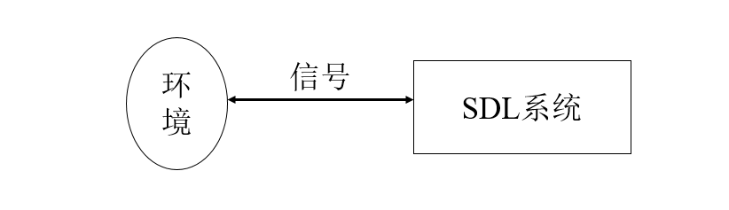

项目结构：
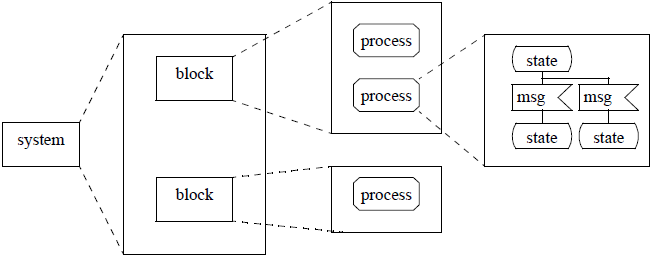

### SDL系统图
完整地描述一个真实系统或系统相对独立的一部分。一个系统可以划分为若干功能块。功能块与环境、功能块之间通过信道连接。

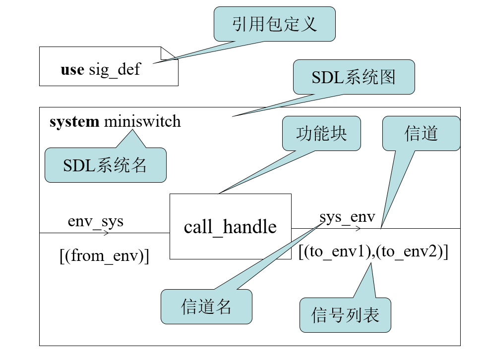

包中的内容是可以重用的：

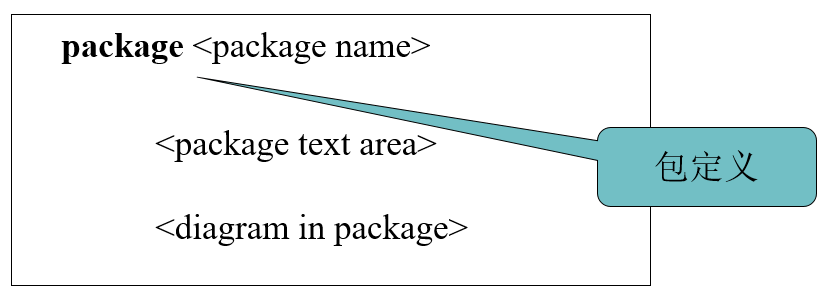

### 信号定义
信号是通信的基本单位。信号定义例子：
```SDL
SIGNAL
from_physics_layer(Frame),
to_physics_layer(Frame),
from_network_layer(Packet),
to_network_layer(Packet);
```

### 信道定义
信道是实体与实体/环境传递信号的通道，由信道名、信号列表构成，用带箭头的连线表示。信道分单向和双向，延迟和非延迟（箭头数量和位置表示）。

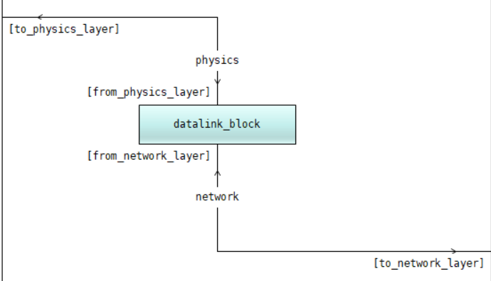

### 功能块定义
系统的组成部分，实现系统的一组功能，一般由一个或多个并发进程组成，可以再细分为子功能块。

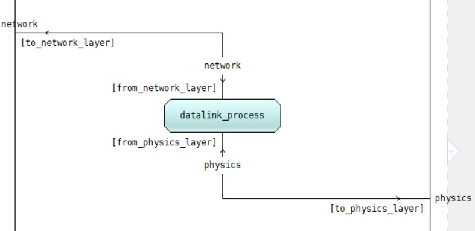

### 进程
进程是系统的基本单位。进程图中，系统行为用状态机图描述。系统中，进程以进程实例（每个实例一个pid）的形式出现。

进程图：

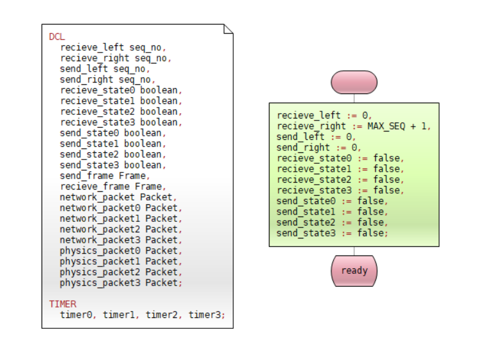

状态机包括：
+ 开始域
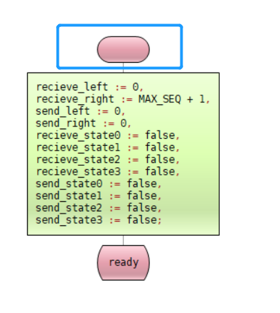
+ 状态域
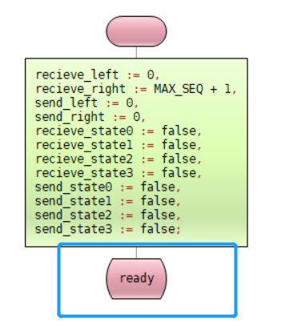
+ 输入域
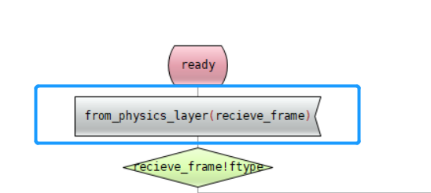
+ 输出域
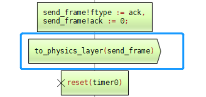
+ 任务域
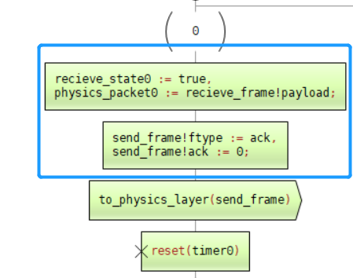
+ 创建域
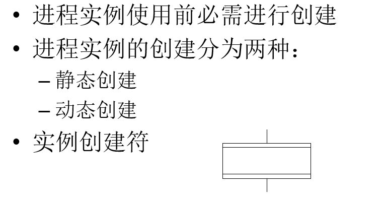
+ 分支域
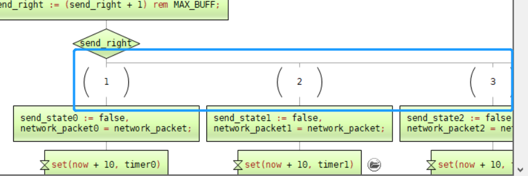
+ 定时器操作


其他：
+ 连接

+ 保存

+ 连续信号
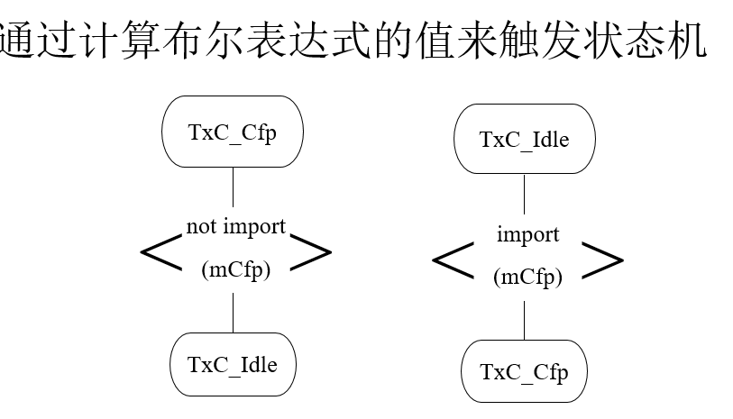
+ 优先输入
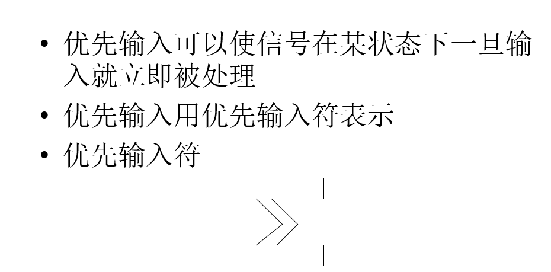

### 过程
过程是进程的一部分，且不存在实例，可以携带参数和返回值。
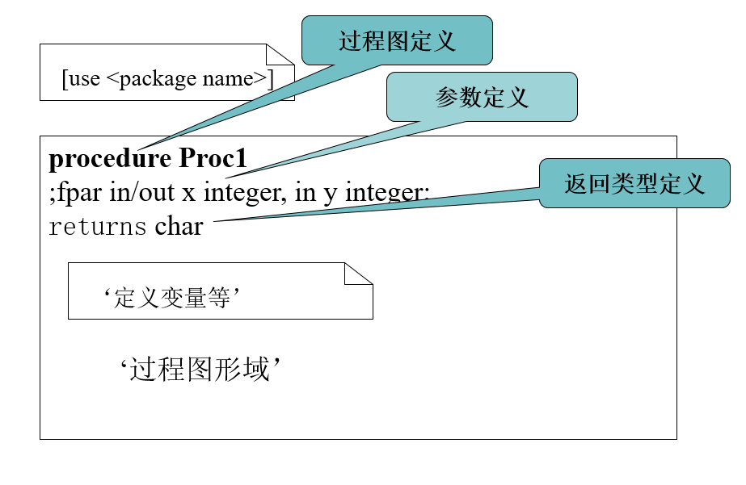

起始符和终止符：
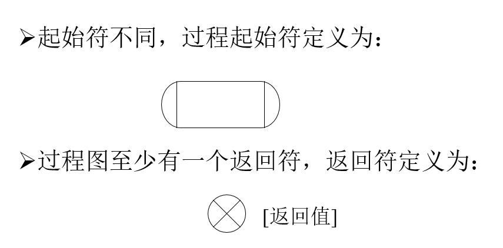

过程调用：
+ 使用创建域
+ 在任务域中调用call

跨进程调用需要把过程定义为远端过程。

### 数据
预定义的数据类：
+ Boolean
+ Character
+ Charstring
+ Integer
+ Natual
+ Real
+ Pid
+ Duration

定义变量：
```SDL
DCL
recieve_left seq_no,
recieve_right seq_no,
send_left seq_no,
send_right seq_no;
```

数组变量：
```
newtype  数组类名
  array(索引项数据类，元素项数据类)
endnewtype;

syntype idx128 = integer constants 0:127
Endsyntype;
newtype  int_array
  array(idx128，integer)
endnewtype;
```

数组初始化：
```
numbers:=(. 0 .)
```

数组访问：
```
multi_a(1)(2)(3):= 0
```

结构体定义：
```
newtype Frame Struct
  ftype frame_type;
  seq seq_no;
  ack ack_no;
  payload Packet;
endnewtype;
```

字面量定义：
```
newtype frame_type
  literals ack, nak, data
endnewtype;
```