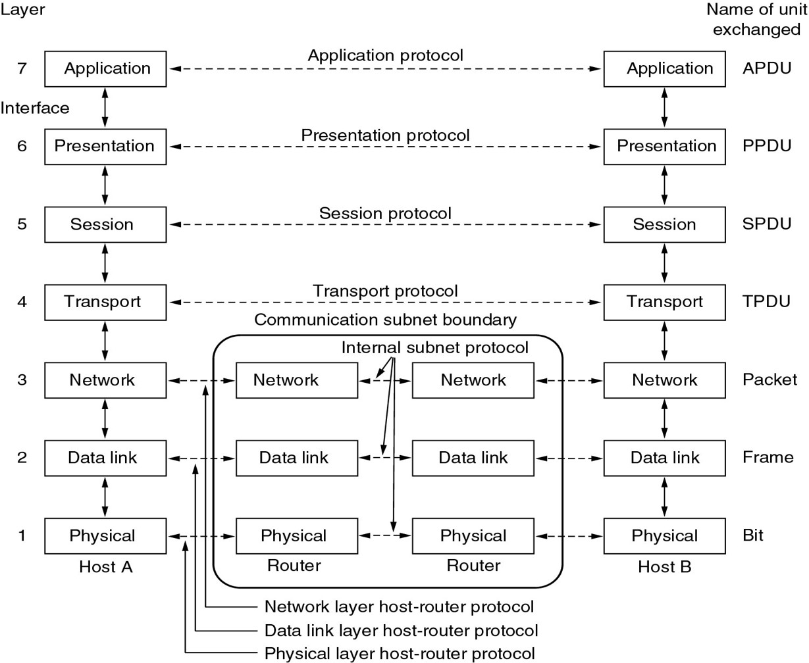
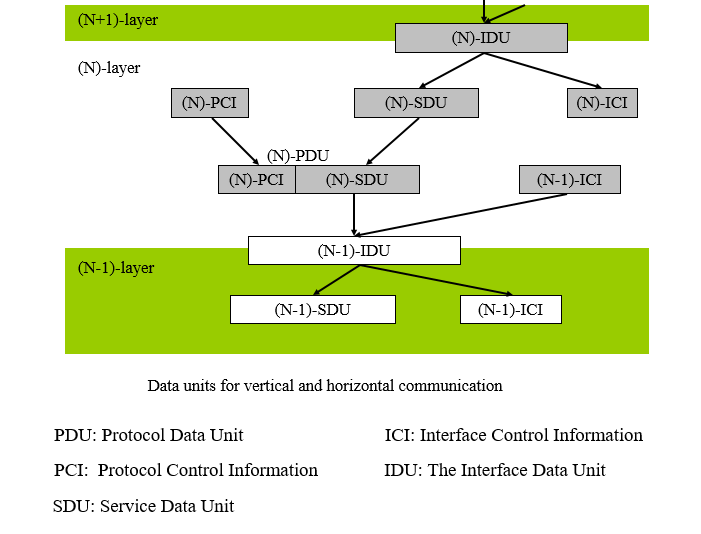
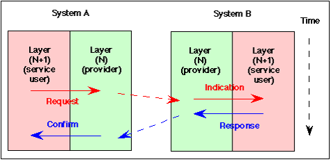
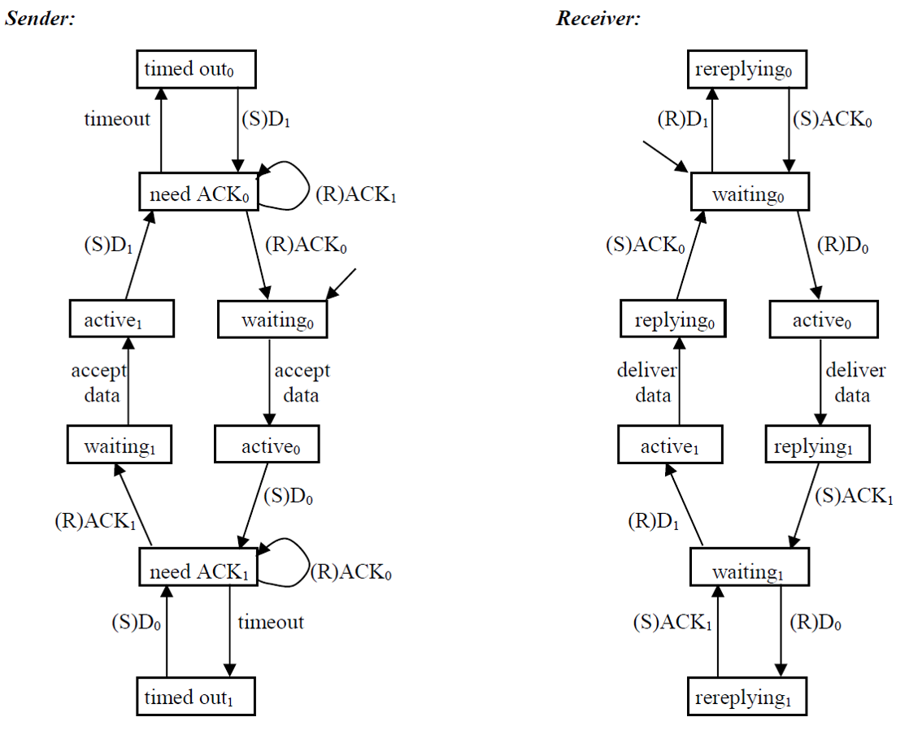
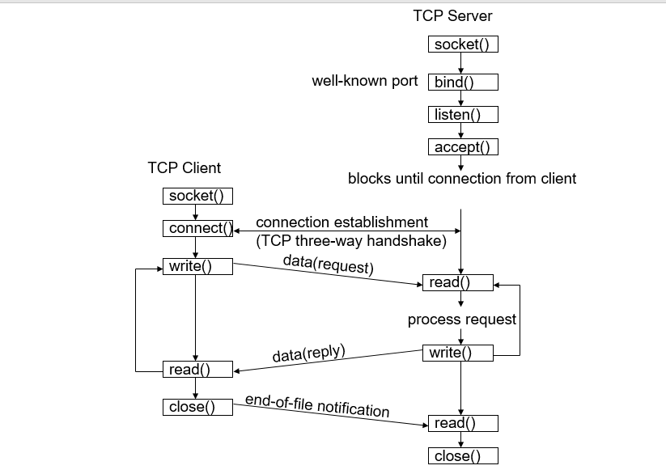
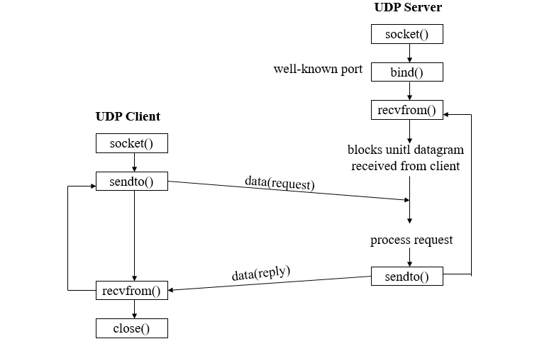
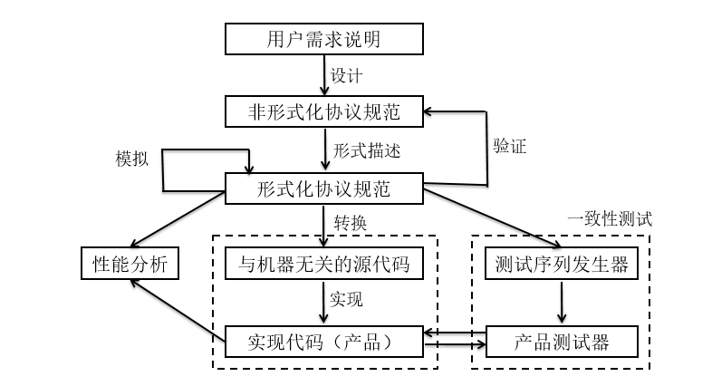

## 通信协议

服务原语：
+ 请求（request）：N+1层向第N层请求服务
+ 表示（indication）：第N层收到请求后向第N+1层返回
+ 响应（response）：N+1层对第N层表示进行响应
+ 确认（confirm）：第N层向第N+1层请求的服务进行确认

## 协议举例
### APB协议
类停等协议，可靠传输。

### Apache ZooKeeper
ZooKeeper 是一种分布式协调服务，用于管理大型主机。在分布式环境中协调和管理服务是一个复杂的过程。ZooKeeper 通过其简单的架构和 API 解决了这个问题。ZooKeeper 允许开发人员专注于核心应用程序逻辑，而不必担心应用程序的分布式特性。

## 协议软件
Socket编程接口是提供给最高三层（指OSI，实际仅有应用层一层）访问传输层的接口。原生Socket可以直接访问网络层协议（IPv4/IPv6）。

TCP Sockect：

UDP Socket:

VFS: Virtual File System，万物皆文件的本质。

## 网络协议开发过程

+ 协议环境分析：用户要求，通道性质，工作模式等
+ 协议功能分析：根据环境分析明确本协议应该具有的功能
+ 协议元素设计：包括协议原语，PDU格式等
+ 形成协议文本：用自然语言描述协议结构和协议元素之间的关系
+ 协议描述：用形式化语言描述协议，包括系统结构、模块划分、系统行为等
+ 协议验证：在开发仿真环境下仿真运行软件，验证协议的正确性
+ 协议实现：用某种语言实现协议软件系统
+ 协议测试：在目标环境下测试协议软件
+ 协议维护：在使用过程中不断完善系统

协议设计质量：
+ 可靠性：包括完整性和一致性。完整性指设计考虑了所有可能发生的事件、选项及服务；一致性指协议满足了用户的需求
+ 高效性：系统资源的使用情况，包括处理器时间、内存、网络访问率等
+ 可维护性
+ 可用性

协议失败的几种情况：
+ 死锁
+ 活锁
+ 不正确的终止

使用工具：
+ SDL
+ UML
+ SPIN & Promela
+ ...

## 协议设计的基本内容
### 协议的通信环境
N层协议的通信环境：
+ 用户要求
+ N - 1层协议的通信环境
+ N层协议运行的操作系统和硬件

根据通道容纳报文的数量，将通道分为三类：
+ 空通道（0）：发送和延时为0的通道
+ 非缓冲通道（1）：任何时刻只有一个报文在传输的通道
+ 缓冲通道（>1）：允许多个报文停留的通道

通道的队列性质：
+ 平均队列长度和最大队列长度：队列越长，延时越长；队列长度超过最大长度将导致丢包
+ 回程时延（RTT）
+ 通道的差错特性
+ 通道可靠性
+ 报文最大长度
+ 通道的工作方式：单工/半双工/全双工，或者分为同步/异步
+ 通道带宽

协议提供的服务：
+ 面向连接
+ 无连接

### 协议功能
+ 连接管理
+ 数据交换（分段/合并，PDU装配与拆装）
+ 差错控制
+ 流量控制
+ 拥塞控制
+ 其他

### 协议元素
+ 服务原语和原语时序
+ PDU及其交换时序
+ 协议状态
+ 协议事件
+ 协议变量
+ 协议操作和谓词

### 协议设计原则
协议的特点：
+ 简单
+ 模块化
+ 有界性
+ 自稳定性：从任一状态开始，在有限时间内经过有限的状态到达稳定状态
+ 自适应性：根据环境而变
+ 健壮性：很好地处理非正常情况
+ 一致性：不能出现死锁、活锁、非正常终止

协议设计的基本原则：
+ 开始设计前确保清楚完整地了解了问题，包括设计标准、要求和限制
+ 不先考虑结构，而先考虑做什么
+ 设计内部功能前先考虑外部功能
+ 简单的方法解决问题
+ 不要将无关问题混在一起
+ 易扩展的
+ 实现设计前先建立原型进行验证
+ 性能分析，有必要时性能优化
+ 一致性检测

### 协议文本
协议文本是协议设计最终阶段的产品，大多数情况使用自然语言描述。

协议文本必须详细描述用户需求、工作模式、协议功能、协议组织和协议元素（最主要）。

协议标准包括：
+ 目的和提供的功能
+ 服务和服务规范
+ 底层协议提供的正确与有效性相关的服务说明
+ 内容结构描述（层内实体及实体间的关系）
+ 层内实体操作的描述
+ 对等实体的通信协议描述
+ 附加信息